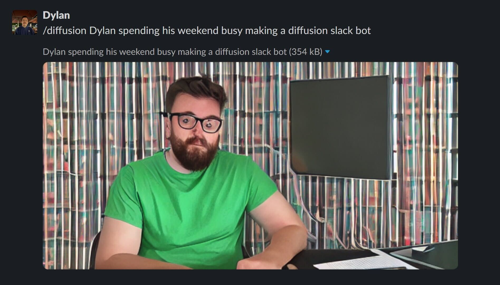

# Slack Diffusion

Slack bot for generating images with [Stable Diffusion](https://stability.ai/blog/stable-diffusion-public-release)



## Usage

### Prereqs

You will need to create some resources outside of this project in order to get it to work. The required resources and their information we will need is as follows:

- Hugging Face
  - Create a [User access token](https://huggingface.co/docs/hub/security-tokens) in your [Hugging Face account](https://huggingface.co/settings/tokens)
    - Note Access token for later
  - Read License and agree to terms for [Stable Diffusion v1.4](https://huggingface.co/CompVis/stable-diffusion-v1-4)
- Slack
  - Create a [Slack app](https://api.slack.com/authentication/basics) with the following user scopes
    - `chat:write`
    - `users:read`
  - Note Signing Secret, Client ID and Client Secret for later
- GCP
  - Create Pub/Sub topic and subscription
  - Storage bucket for image uploads
  - Note Topic, Subscription and Bucket for later


### Build

Only the request processor here is required to be built, this can be done as follows:
```shell
$ docker build -t slack-diffusion .
```


### Run

#### Authentication handler [`functions.AuthenticationFunction`](functions.go#L270)
This can be deployed using any method you wish that is publicly accessible. Should you choose to use Google Cloud Functions, all the required code in this project can be found in [`functions.zip`](`functions.zip`).

Required env vars
  - `PROJECT_ID` // GCP Project ID

Once function has been deployed, update [request URL in Slack](https://api.slack.com/authentication/oauth-v2) to point to deployment.


#### Slash command handler [`functions.SlashFunction`](functions.go#L75)
This can be deployed using any method you wish that is publicly accessible. Should you choose to use Google Cloud Functions, all the required code in this project can be found in [`functions.zip`](`functions.zip`).

Required env vars
  - `PROJECT_ID` // GCP project ID
  - `PUBSUB_TOPIC` // Pub/Sub topic created earlier
  - `SLACK_SIGNING_SECRET` // Slack signing secret (recommend using Google Secret Manager here if running on Cloud Functions)
  - `SLACK_CLIENT_ID` // Slack client ID (recommend GSM)
  - `SLACK_CLIENT_SECRET` // Slack client secret (recommend GSM)

Once function has been deployed, create a [slash command in Slack](https://api.slack.com/interactivity/slash-commands) and point to deployment.


At this point you should be able to successfully call the diffusion bot from within Slack, with status hanging on _`Sending...`_

#### Request processor / Image generation [`main.main`](diffusion.go#L69)

Ensure your application-default-credentials have been updated with `$ gcloud auth login --update-adc`.
Recommended to run on a machine with graphics card with >8GB memory.

```shell
$ docker run --rm --gpus=all \
  -v huggingface:/home/huggingface/.cache/huggingface \
  -v ~/.config/gcloud:/home/huggingface/.config/gcloud \
  --env-file docker.envs \
  slack-diffusion
```

The following environment variables can be filled into [`docker.envs`](docker.envs)

Required env vars
  - `HUGGINGFACE_TOKEN` // user access token from Hugging Face
  - `PROJECT_ID` // GCP project ID
  - `PUBSUB_SUBSCRIPTION` // Pub/Sub subscription created earlier
  - `STORAGE_BUCKET` // Storage bucket created earlier

Optional env vars
  - `IMAGE_WIDTH` // width of generated images, must be divisible by 8, defaults to 512
  - `IMAGE_HEIGHT` // height of generated images, must be divisible by 8, defaults to 512


You should now be able to generate images through Slack using Stable Diffusion, great success 👍

## Thanks

Based on works by:
- [jamesrom/discord-diffusion](https://github.com/jamesrom/discord-diffusion)
- [fboulnois/stable-diffusion-docker](https://github.com/fboulnois/stable-diffusion-docker)
